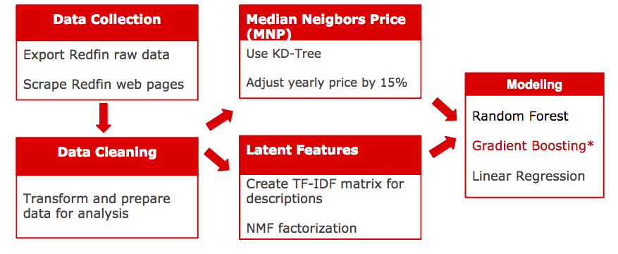

# PriceHome

## Summary

During the past three years, the low inventory and high demand in San Francisco has lead to a constantly high price increase. On average, there is 15% increase each year on the home market in San Francisco.

PriceHome intends to help whoever wants to buy a home in San Francisco to predict the market value of a new listing. PriceHome used machine learning approach combining K-nearest Neighbors, Binary Space Partitioning, Gradient Boosting, Natural language Processing methods to accomplish this task.

## Data Pipeline

### Data Source
I collected data by two means:
* Downloading csv files from redfin.com, which includes basic listing information such as last sale price, number of beds, number of baths, sqft, lot size, parking information, years of built, etc.

* Scraping redfin home page to get description, listing date, HOA amount, home style, transportation, and shopping information.

Originally, I collected six month data from May 2015 to Oct 2015 with 2389 homes in San Francisco. The whole data set includes 18527 homes during the past three years (Oct 2012 to Oct 2015).

I used clean.py to clean and prepare data.

### Featurization
To predict the price, I used Medain Neighbors Price to approximate the way how real estate agents do in real life. I also added basic listing information as features (sqft, lot size, parking information, years of built, HOA amount, home style etc). In addition, I extracted four latent features from listing descriptions to capture more information about a listing.

#### Median Neighbors Price
I used k-Nearest Neighbors algorithm to find the k nearest neighbors, and calculate the median price. Finding the geographically closed comparable listings to any given listing involves computationally expansive calculation. I adopted KD-Trees to recursively partition the dataset by latitude and longitude before doing the search.

#### Latent Features
I vectoriezed the descriptions of the listings with TF-IDF, then used Non-negative Matrix Factorization to get four latent features and incorperated them into my models

## Models
I compared random forest, linear regression and gradient boosting and found gradient boosting performed the best.
I did six set ups in my study, and compared the results of each set up.

## Possible future work
Extract more features from web page (school information, more interior information)
Personalize the model by zip codes

## Libraries Used
Numpy
Pandas
scikit-learn
matplotlib
urllib
BeautifulSoup
NLTK

